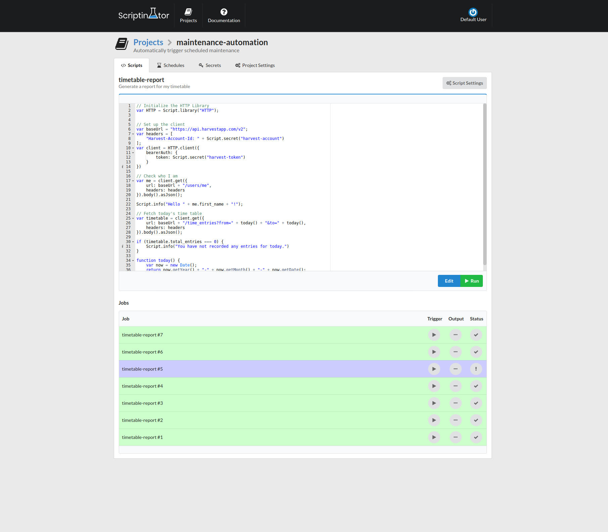
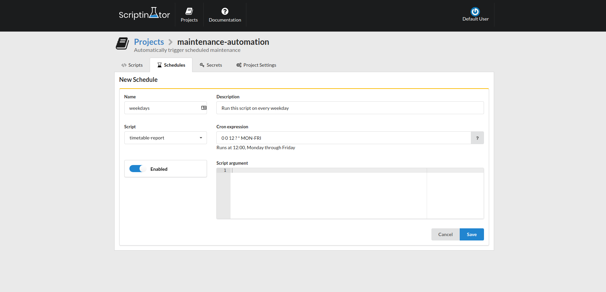

[](https://scriptinator.io)

[](http://www.apache.org/licenses/LICENSE-2.0)
[](https://sonarcloud.io/dashboard?id=io.chapp.scriptinator%3Ascriptinator-parent)
[](https://slack-invite.scriptinator.io)
[](https://circleci.com/gh/ScriptinatorIO/scriptinator/tree/master)
[](https://waffle.io/ScriptinatorIO/scriptinator)


Scriptinator lets you build, deploy and maintain scripts without having to worry about servers and complex architecture.
And the best part of it: It is **super simple!**

- Write only tiny, easy to maintain scripts
- Scale without a single change to your scripts
- Integrate with any application through our OAuth API, webhooks or schedules
- 100% free & open source
- Available in the [cloud](https://scriptinator.io) or on-premise

> This project is still in development. This means we take your feedback very seriously. If you have any feedback,
questions or feature requests please let us know by email (support@scriptinator.io) or through [slack](https://slack-invite.scriptinator.io).

## Screenshots





## Documentation

Take a moment to glance through the [documentation](https://scriptinator.io/docs) of the latest version. If you have
any requests or unanswered questions, do not hesitate to send a quick message to support@scriptinator.io or create
a [GitHub issue](https://github.com/ScriptinatorIO/scriptinator/issues).


## Self Hosted Quickstart

If you want to try out Scriptinator on your own infrastructure, you can take the following steps:

1. [Install Docker](https://docs.docker.com/install/) on one or more hosts
2. Initialize you docker swarm manager by running:
   ```bash
   docker swarm init
   ```
3. Create a file called `stack.yml` containing:
    ```yml
    version: '3.5'
    
    services:
      proxy:
        image: traefik
        ports:
          - 80:80
        volumes:
          - /var/run/docker.sock:/var/run/docker.sock
        command: |
          --docker
          --docker.swarmmode
          --docker.watch
    
      web:
        image: scriptinator/scriptinator-web:1.0-SNAPSHOT
        deploy:
          labels:
            traefik.port: 8081
            traefik.frontend.rule: PathPrefix:/
        command: |
          --spring.datasource.url=jdbc:mysql://mysql:3306/scriptinator?useSSL=true&verifyServerCertificate=false&autoReconnect=true
          --spring.rabbitmq.host=rabbitmq
      worker:
        image: scriptinator/scriptinator-worker:1.0-SNAPSHOT
        command: |
          --spring.datasource.url=jdbc:mysql://mysql:3306/scriptinator?useSSL=true&verifyServerCertificate=false&autoReconnect=true
          --spring.rabbitmq.host=rabbitmq
      scheduler:
        image: scriptinator/scriptinator-scheduler:1.0-SNAPSHOT
        command: |
          --spring.datasource.url=jdbc:mysql://mysql:3306/scriptinator?useSSL=true&verifyServerCertificate=false&autoReconnect=true
          --spring.rabbitmq.host=rabbitmq
      docs:
        image: scriptinator/scriptinator-docs:1.0-SNAPSHOT
        deploy:
          labels:
            traefik.port: 80
            traefik.frontend.rule: PathPrefixStrip:/docs
    
      mysql:
        image: mysql:5.7
        environment:
          MYSQL_DATABASE: scriptinator
          MYSQL_ROOT_PASSWORD: root
      rabbitmq:
        image: rabbitmq:3.7-management
    ```
4. Start Scriptinator by running:
   ```bash
   docker stack deploy --compose-file ./stack.yml --resolve-image always scriptinator
   ```
5. Wait a couple of minutes for Scriptinator to start
6. The dashboard should be available at [http://127.0.0.1/dashboard](http://127.0.0.1/dashboard). If you see the
**Bad Gateway** error message, try refreshing in a moment. This message means the server is still booting up.
7. Log in to the dashboard using the username **user** and password **default**.

## The Scriptinator Team

The current code contributors can be found in [**AUTHORS.MD**](AUTHORS.md).

## Copyright / License

Copyright 2018 Scriptinator (support@scriptinator.io)

Licensed under the Apache License, Version 2.0 (the "License");
you may not use this file except in compliance with the License.
You may obtain a copy of the License at

   http://www.apache.org/licenses/LICENSE-2.0

Unless required by applicable law or agreed to in writing, software
distributed under the License is distributed on an "AS IS" BASIS,
WITHOUT WARRANTIES OR CONDITIONS OF ANY KIND, either express or implied.
See the License for the specific language governing permissions and
limitations under the License.